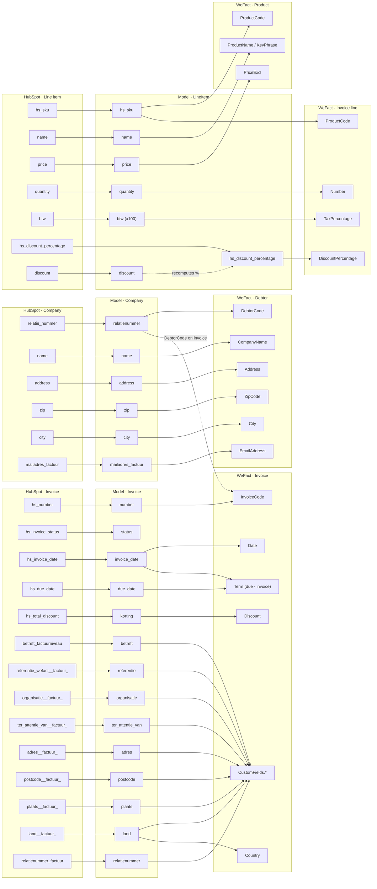

# Field mapping: HubSpot → model → WeFact

This document traces how data flows through the three layers of the integration:

**HubSpot property → Pydantic model field → WeFact API field**

## Overview diagram

> **Contact** (`lastname`, `factuur_toelichting`) is fetched but never mapped to any WeFact object, so it is omitted from the diagram.

## 1. Invoice

HubSpot invoice object (`get_invoices` / `hubspot_api/api.py:70`) → `Invoice` model
(`models/invoice.py`) → WeFact invoice (`invoice_data_from_model` / `wefact_api/invoice.py:41`).

| HubSpot property | `Invoice` field | WeFact field | Notes |
|---|---|---|---|
| `hs_number` | `number` | `InvoiceCode` | |
| `hs_invoice_status` | `status` | — | drives sync state (`state/db.py`), not sent; WeFact `Status` hardcoded to `Verzonden` |
| `hs_amount_billed` | `amount_billed` | — | fetched, not sent |
| `hs_invoice_date` | `invoice_date` | `Date` | |
| `hs_due_date` | `due_date` | — | combined with `invoice_date` → `Term` = `(due_date − invoice_date).days` |
| `hs_total_discount` | `korting` | `Discount` | |
| `betreft_factuurniveau` | `betreft` | `CustomFields.factuurbetreft` | |
| `referentie_wefact__factuur_` | `referentie` | `CustomFields.factuurreferentie` | |
| `organisatie__factuur_` | `organisatie` | `CustomFields.factuurorganisatie` | |
| `ter_attentie_van__factuur_` | `ter_attentie_van` | `CustomFields.factuurtav` | |
| `adres__factuur_` | `adres` | `CustomFields.factuuradres` | |
| `postcode__factuur_` | `postcode` | `CustomFields.factuurpostcode` | |
| `plaats__factuur_` | `plaats` | `CustomFields.factuurplaats` | |
| `land__factuur_` | `land` | `CustomFields.factuurland` **and** `Country` | only field mapping to two WeFact targets |
| `relatienummer_factuur` | `relatienummer` | `CustomFields.factuurrelatienummer` | informational only — does not set `DebtorCode` (intended) |
| `hs_balance_due`, `hs_discount_percentage` | — | — | requested in `properties` but never read into the model |

WeFact `DebtorCode` comes from `company.relatienummer` (`wefact_api/invoice.py:55`), not the invoice.

## 2. Company → Debtor

HubSpot company (`_fetch_company` / `hubspot_api/api.py:159`) → `Company` model
(`models/company.py`) → WeFact debtor (`wefact_api/debtor.py`).

| HubSpot property | `Company` field | WeFact field | Notes |
|---|---|---|---|
| `relatie_nummer` | `relatienummer` | `DebtorCode` | falls back to `company_id` if empty (`hubspot_api/api.py:170`) |
| `name` | `name` | `CompanyName` | |
| `address` | `address` | `Address` | |
| `zip` | `zip` | `ZipCode` | |
| `city` | `city` | `City` | |
| `mailadres_factuur` | `mailadres_factuur` | `EmailAddress` | |
| `email` | `email` | — | fetched, not sent |
| `land` | `land` | — | fetched, not sent to debtor |

## 3. Line item → Product + Invoice line

HubSpot line_item (`_fetch_line_items` / `hubspot_api/api.py:202`) → `LineItem` model
(`models/line_item.py`) → WeFact product (`wefact_api/product.py`) and invoice line
(`wefact_api/invoice.py:63`).

| HubSpot property | `LineItem` field | WeFact field | Notes |
|---|---|---|---|
| `hs_sku` | `hs_sku` | `ProductCode` (product + line) | required; line skipped if missing |
| `name` | `name` | `ProductName` **and** `ProductKeyPhrase` | |
| `price` | `price` | `PriceExcl` (product) | |
| `quantity` | `quantity` | `Number` (line) | cast to int |
| `btw` | `btw` | `TaxPercentage` (line) | multiplied ×100 in `_build_line_item` |
| `hs_discount_percentage` | `hs_discount_percentage` | `DiscountPercentage` (line) | recomputed from `discount` if a discount amount is present |
| `discount` | `discount` | — | only used to derive the percentage above |
| `amount` | `amount` | — | fetched, not sent |
| `voorraadnummer`, `kostenplaats`, `grootboek`, `gewicht`, `artikelsoort`, `artikelgroep`, `hs_tax_rate_group_id` | same names | — | in model but never sent to WeFact |

## 4. Contact

`Contact` (`_fetch_contact` / `hubspot_api/api.py:174`) is fetched (`lastname`,
`factuur_toelichting`) and returned from `get_invoice_details`, but is **never mapped to any
WeFact object** in the current code.
